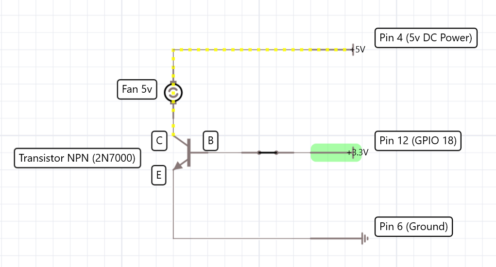

# Raspberry Fan

> A python script to enable or disable raspberry fan when cpu temperature exceeds 45°C

## Requirements

- Raspberry
- Fan
- Transistor NPN (2N7000)

## Schema

## Script

See [fan.py](fan.py)